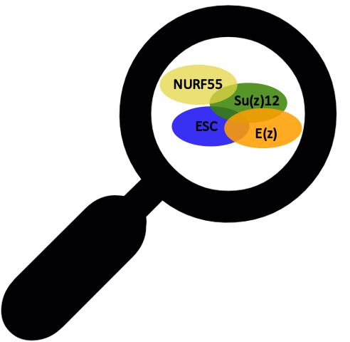

PolycombGroup(PcG)-finder

Overview
PcG-finder is a computational pipeline to identify Polycomb-group (PcG) proteins  homologous in eukaryotes. PcG-finder can be run using any set of sequence data, as long as sequences are in fasta format. PcG-finder is a python script to apply pipeline employs hmmer (jackhmmer) protein search and eggNOG mapper to find a robust protein homologous within a big protein database. Finally, the selected protein searched for the domain architecture using hmmerscan. All results will be reported in a tab-delimited file.

PcG-finder can be used to process sequences downloaded directly from GenBank/NCBI local sequence data (e.g. sequences not downloaded from GenBank such as unpublished data), or a combination of both. PcG-finder process total predicted proteins based on genomics or transcriptomics data. PcG-finder offers the option to select a different PcGs’ sub-units (E(z),Su(z)12, ESC, or NURF55); to allow users to find the homologous of each sub-unit separately. Also, PcG-finder offers a multi-threading option for fast and short-time computing.

PcG-finder is scalable and can be used to process a variety of datasets, ranging from small datasets (one species) to large datasets with thousands of proteins. PcG-finder was intended to be objective and repeatable and provides a meaningful output at every step to help guide user decisions.

PcG-finder is described in more detail in the following publication:

The article is still in preparation.

 A visual overview of the major steps in PcG-finder is shown below:
