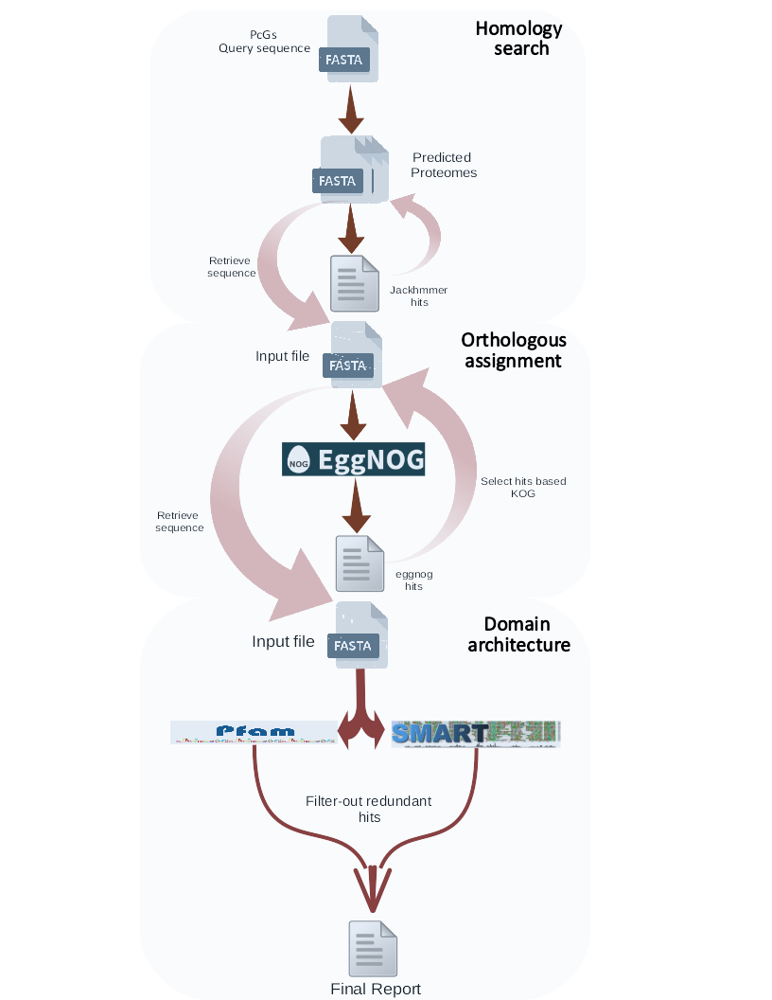

# PolycombGroup(PcG)-finder

Overview

PcG-finder is a computational pipeline to identify Polycomb-group (PcG) proteins  homologous in eukaryotes. PcG-finder can be run using any set of sequence data, as long as sequences are in fasta format. PcG-finder is a python script to apply pipeline employs hmmer (jackhmmer) protein search and eggNOG mapper to find a robust protein homologous within a big protein database. Finally, the selected protein searched for the domain architecture using hmmerscan. All results will be reported in a tab-delimited file.

PcG-finder can be used to process sequences downloaded directly from GenBank/NCBI local sequence data (e.g. sequences not downloaded from GenBank such as unpublished data), or a combination of both. PcG-finder process total predicted proteins based on genomics or transcriptomics data. PcG-finder offers the option to select a different PcGs’ sub-units (E(z),Su(z)12, ESC, or NURF55); to allow users to find the homologous of each sub-unit separately. Also, PcG-finder offers a multi-threading option for fast and short-time computing.

PcG-finder is scalable and can be used to process a variety of datasets, ranging from small datasets (one species) to large datasets with thousands of proteins. PcG-finder was intended to be objective and repeatable and provides a meaningful output at every step to help guide user decisions.

PcG-finder is described in more detail in the following publication:

The article is still in preparation.

 A visual overview of the major steps in PcG-finder is shown below:

Installation
PcG-finder is written in Python (compatible with 3.0 or more). The required dependencies will be downloaded and executed during the installation of PcG-finder as a Python package or library. PcG-finder directory must be used as a working directory, then the input file(s) must be transferred to the PcG-finder directory but the output folder can be elsewhere. PcG-finder requires a 40 GB free-space to download the necessary databases. There are only two external dependencies that should be installed before using PcGs-finder:

    • HMMER: biosequence analysis using profile hidden Markov model.
http://hmmer.org 
    • eggnog-mapper.
 https://github.com/eggnogdb/eggnog-mapper 

Helpful installation instructions for these dependencies can be found on the previous links. 

PcG-finder scripts can be run using Mac OSX (10.10+) and Linux, and can also work with Windows using a program like Cygwin. PcG-finder can install using the following command:

./setup.py 
OR
python3 setup.py

Usage
PcG-finder can be run using following command:

./PcGs_finder.py [-h] -i INFILE -pg PCG -o OUTFOLDER [-t THREADS] (it's 10 by default) 

PcG-finder can be tested for the first time through the available test data (Athaliana.fasta; the total predicted protein of Arabidopsis thaliana).

Examples commands:

for E(z) sub-unit:
./PcGs_finder.py -i Athaliana.fasta -pg ezh -o TEST 

for Su(z)12 sub-unit:
./PcGs_finder.py -i Athaliana.fasta -pg suz12 -o TEST 

for ESC sub-unit:
./PcGs_finder.py -i Athaliana.fasta -pg esc -o TEST     

for NURF55 sub-unit:
./PcGs_finder.py -i Athaliana.fasta -pg p55 -o TEST 
